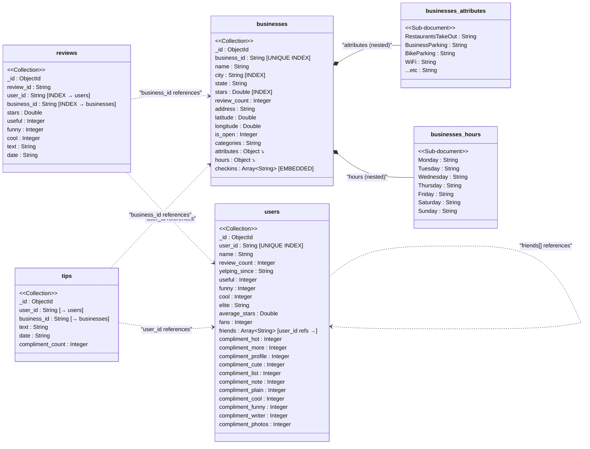

# Document Schema Diagram — MongoDB Collections

> Render this Mermaid diagram at https://mermaid.live or in any Markdown viewer that supports Mermaid.

## Key Structural Decisions

1. **Checkins embedded as flat array**: The `checkins` field inside `businesses` is a simple array of date strings (e.g., `["2019-03-15 20:13:00", ...]`). This is ideal because checkins are always queried alongside business data (Query 7 uses `$size` on this array), and the array is bounded per business.

2. **`attributes` and `hours` as nested sub-documents**: These are naturally nested key-value pairs that belong exclusively to a business. No need for separate collections — they are always read with the business.

3. **`friends` as an array of ID strings**: Rather than a separate junction collection (which would be normalized-relational), friends are stored as an array of `user_id` strings inside the user document. This makes friend-count queries trivial (`$size`) and avoids an extra collection and join. The trade-off is that updating a friendship requires modifying both user documents.

4. **Reviews and Tips as separate collections with foreign keys**: Both grow unboundedly and are queried independently (e.g., aggregation by date, by stars). Cross-collection `$lookup` joins are used where needed (Queries 2, 4).

## Indexes Defined

| Index | Collection | Type | Justification |
|---|---|---|---|
| `business_id` | businesses | Unique | Primary lookup key; used by reviews/tips for `$lookup` joins |
| `city` | businesses | Standard | Query 1, 2 group by city; speeds up city-level aggregations |
| `stars` | businesses | Standard | Query 1, 3 filter/sort by star rating |
| `user_id` | users | Unique | Primary lookup key for user data |
| `business_id` | reviews | Standard | Joins reviews to businesses in Queries 2, 4, 7 |
| `user_id` | reviews | Standard | Joins reviews to users in Query 5 |
