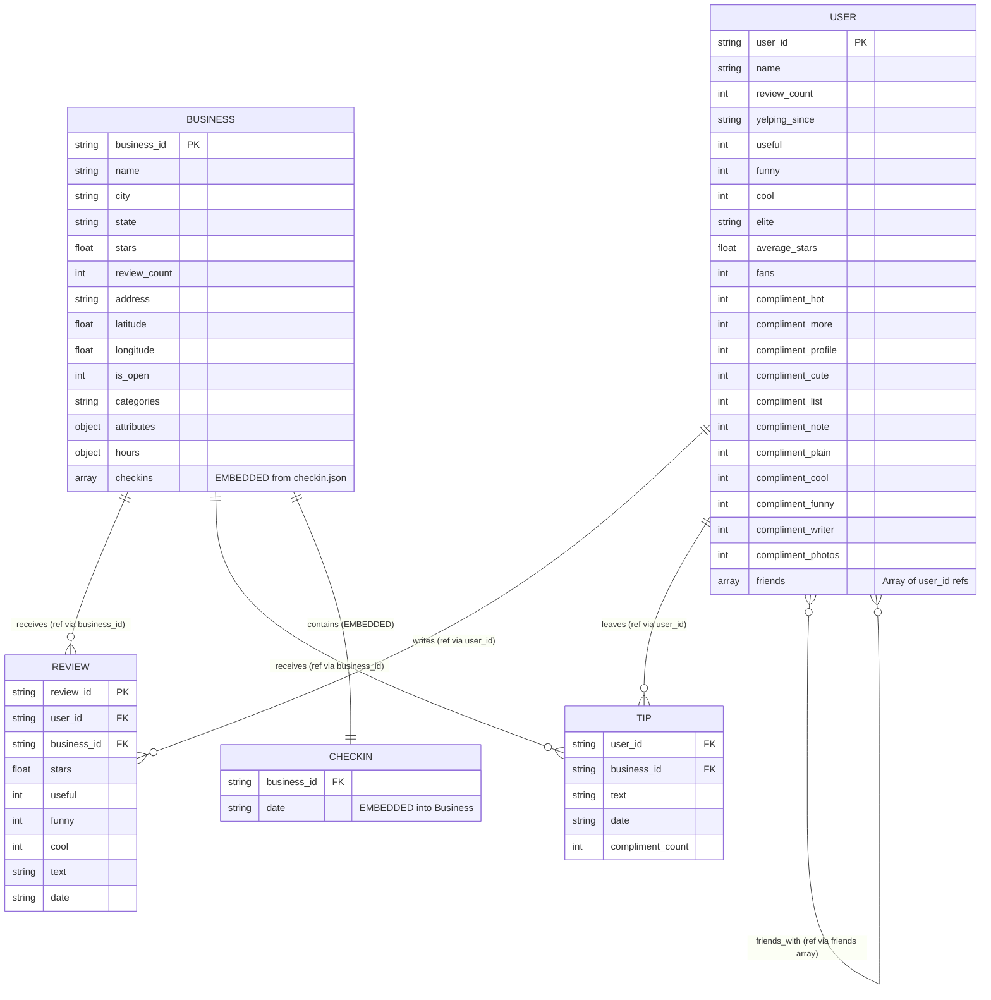

# E-R Diagram — MongoDB Schema

> Render this Mermaid diagram at https://mermaid.live or in any Markdown viewer that supports Mermaid.

## Relationship Explanations

| Relationship | Type | Justification |
|---|---|---|
| **Business ↔ Checkins** | **Embedded** | Checkins are bounded per business and always queried alongside business data (Query 7). Embedding avoids a `$lookup` and keeps reads fast. |
| **Business ↔ Reviews** | **Referenced** (via `business_id` in reviews collection) | Reviews are unbounded and can grow to thousands per business. Embedding would exceed the 16MB document limit. Referencing keeps writes cheap. |
| **User ↔ Reviews** | **Referenced** (via `user_id` in reviews collection) | Same reasoning — a user can write thousands of reviews. `$lookup` is used when needed (Queries 2, 4). |
| **User ↔ Tips** | **Referenced** (via `user_id` in tips collection) | Tips are unbounded per user. Separate collection keeps user documents lean. |
| **Business ↔ Tips** | **Referenced** (via `business_id` in tips collection) | Tips are unbounded per business. |
| **User ↔ User (Friends)** | **Referenced** (array of `user_id` strings embedded in user doc) | The friends list is stored as an array of IDs within the user document. This is a hybrid approach — the array is embedded, but each ID references another user document. This avoids a separate junction collection while keeping friend lookups efficient. |
