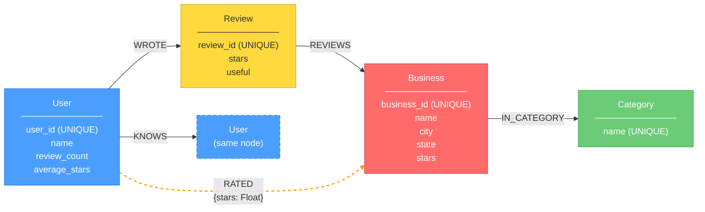

# Property Graph Model Diagram — Neo4j

> Render this Mermaid diagram at https://mermaid.live or in any Markdown viewer that supports Mermaid.

> **Diagram notes:**
> - The dashed `RATED` edge is a **shortcut/denormalized relationship** (hence the distinct styling).
> - The `KNOWS` edge targets a second "User (same node)" box because Mermaid cannot render true self-loops. In the actual Neo4j graph, `KNOWS` is a self-referential relationship on the same `:User` node label.
> - `{stars: Float}` on the `RATED` edge indicates a relationship property.

## Node Labels & Properties

| Node Label | Properties | Constraint |
|---|---|---|
| **User** | `user_id`, `name`, `review_count`, `average_stars` | `user_id` UNIQUE |
| **Business** | `business_id`, `name`, `city`, `state`, `stars` | `business_id` UNIQUE |
| **Review** | `review_id`, `stars`, `useful` | `review_id` UNIQUE |
| **Category** | `name` | `name` UNIQUE |

## Relationship Types

| Relationship | Direction | Properties | Description |
|---|---|---|---|
| **WROTE** | `(User)→(Review)` | — | A user authored a review |
| **REVIEWS** | `(Review)→(Business)` | — | A review is about a business |
| **RATED** | `(User)→(Business)` | `stars` | ⚡ Shortcut edge: direct link from user to business with the star rating. Avoids traversing through Review for simpler queries (e.g., Query 2 friend recommendations). |
| **IN_CATEGORY** | `(Business)→(Category)` | — | A business belongs to a category (many-to-many naturally modelled as edges) |
| **KNOWS** | `(User)→(User)` | — | Social friendship connection |

## Modelling Choices & Justifications

### 1. Review as a Node (not just an edge)
Reviews carry rich properties (`stars`, `useful`) and connect **three** entities (user, business, and the review text/metadata itself). Modelling Review as a node allows us to attach properties and traverse flexibly (e.g., "find all reviews of businesses in category X written by friends of user Y").

### 2. RATED Shortcut Relationship
The `RATED` edge is a **denormalized shortcut** from User directly to Business, storing the `stars` property. This avoids the two-hop `(User)-[:WROTE]->(Review)-[:REVIEWS]->(Business)` traversal for common queries like "which businesses has this user rated?" — making Cypher Query 2 (friend recommendations) and Query 4 (category-specific ratings) significantly faster.

### 3. Category as a Separate Node
In MongoDB, categories are stored as a comma-separated string inside the business document. In the graph model, each category is a separate `Category` node with `IN_CATEGORY` edges. This naturally handles the **many-to-many** relationship (a business has many categories; a category contains many businesses) without any string splitting or `$unwind` — it's just edge traversal.

### 4. KNOWS Relationship (Directed)
Friend connections are modelled as directed `KNOWS` edges. While friendships are logically bidirectional, the source data only provides one direction (user A lists user B as a friend). The Cypher queries account for this by matching outgoing edges `(u)-[:KNOWS]->(f)`.

### 5. What's NOT in the Graph
- **Tips**: Not ingested into Neo4j since none of the Cypher queries require tip data. Including them would add unnecessary nodes/edges.
- **Checkins**: Similarly omitted — checkin analysis is handled entirely in MongoDB (Query 7) where the embedded array model is more natural.
- **Review text**: Not stored on Review nodes to keep the graph lightweight. Text analysis is done in MongoDB.
